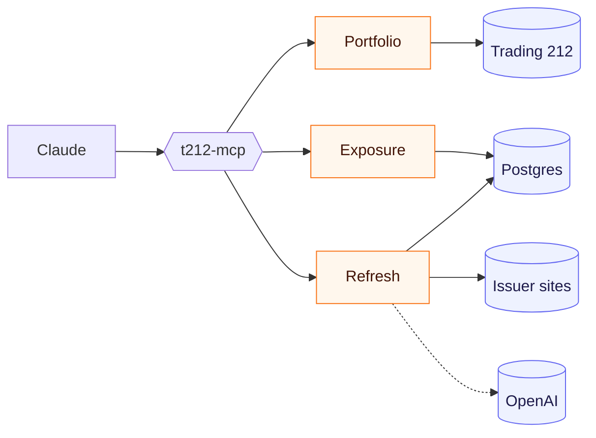
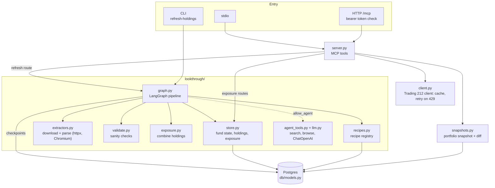
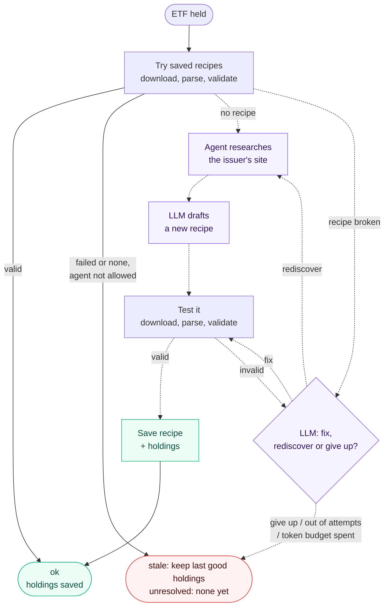
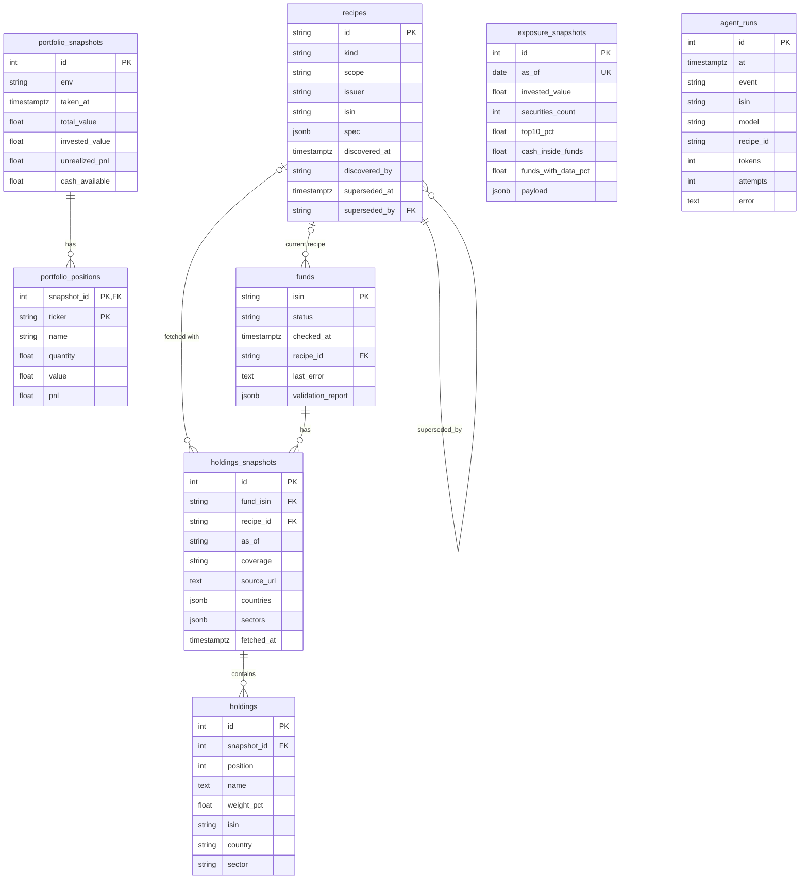

# Architecture

## High-level flow

Claude calls a tool, and the server handles it on one of three routes. The dotted line is only used with `allow_agent`.

| Route | Tools | Reads from | Writes to | Speed |
|---|---|---|---|---|
| 1. Portfolio | `get_portfolio_update`, `get_account_summary`, `get_positions`, `get_position`, `get_dividends`, `get_order_history`, `get_transactions` | Trading 212 API (briefly cached) | `get_portfolio_update` saves a snapshot | Seconds |
| 2. Exposure | `get_etf_exposure`, `get_exposure_changes`, `get_holdings_status` | Postgres only | Nothing | Instant |
| 3. Refresh | `refresh_etf_holdings` (or `t212-mcp refresh-holdings`) | Trading 212, issuer sites, OpenAI if the agent is allowed | Recipes, fund status, holdings, exposure snapshot | Seconds without the agent, minutes with it |

Route 2 only shows what route 3 last saved, so run a refresh first.

## Inside the server

## Refresh route in detail (per fund)

A refresh loads your positions from Trading 212, runs this flow for each ETF, then combines the results into one exposure snapshot. Dotted steps only run with `allow_agent`.

## Data model

`exposure_snapshots` and `agent_runs` have no foreign keys. Exposure is a computed daily summary, and `agent_runs` is an append-only log.
